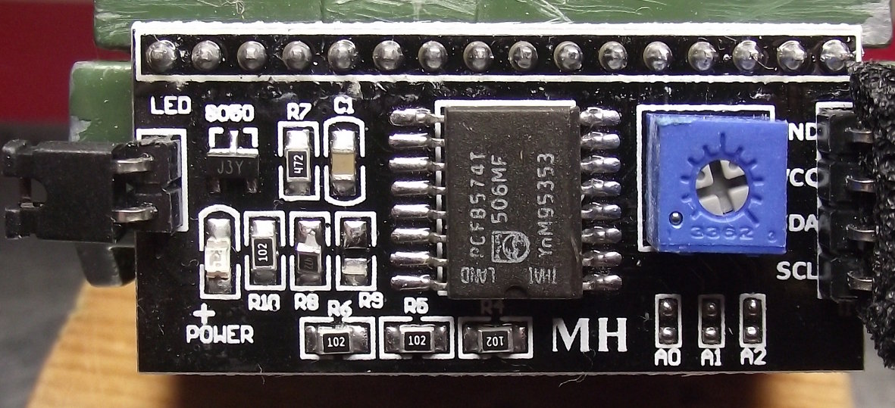

Introduction
============

This is a simple library for small LCD-displays with 16x2 or 20x4 characters
known as HD44780-displays. You can attach these displays directly to your
MCU, but since this consumes 8 pins the display is usually attached to
a serial multiplexer. This library supports the PCF8574T.

Adafruit supports the MCP230xx multiplexer with their own library
(lib `adafruit_character_lcd` with class `character_lcd_i2c`),
but chances are high that your cheap device from Amazon or Ebay has a
PCF8574T instead.

Hardware-Mods
-------------

Note that the LCD is a 5V device and that the serial interface has two
pullups for SDA/SCL to 5V (labelled R8 and R9). Although this library
does not read from the bus it is best to remove the pullups and provide
the i2c-pullups yourself (either configure the internal pullups of your
MCU if available or add external pullups to 3.3V).

In this image

the R9 pullup is already removed and the R8 is about to be removed.

Installation
------------

Just copy the file `lib/hd44780.py` to the lib-directory of your device.

You also need the `busio`-library from the CircuitPython library-bundle.

API
---

The API is very simple:

  - `hd44780(i2c=None,address=0x27,trans_map={})`: constructor
  - `backlight(on)`: pass `True` to activate the backlight
  - `clear()`: clear the LCD and move to first line
  - `write(string,line)`: write the given string to the given line

The translation-map in the constructor maps a character to the correct
character of the LCD, e.g. on my display I use

    trans_map = {"°":223}

to map the degrees-character to chr(223). Run 

    examples/show_charset.py $(seq 0 15)

to show all available chars of your display.

There are a number of simple examples in `examples`-directory.
